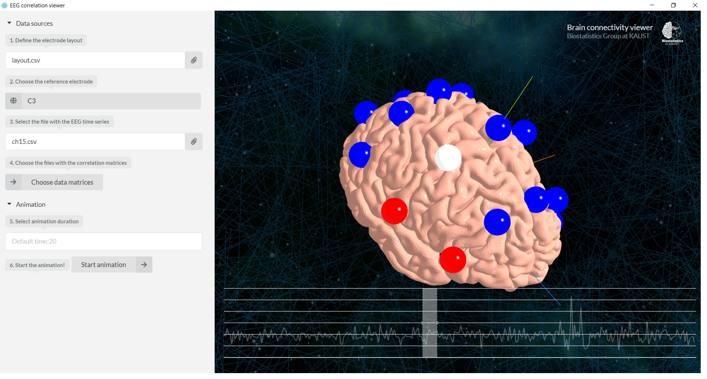

# BCC: Brain Correlation Clustering

BCC is an animated visualization tool for denoting hierarchical cluster coherence in brain time series. It provided a smooth interface for visually exploring the time-evolving topographic characteristics in a 3D environment based on the results of using the hierarchical cluster coherence method described in Euan et al. [HCC]. It was entirely written in the Javascript programming language using the functionalities of the WebGL standard.

[HCC] Euán, C., Sun, Y. & Ombao, H. Coherence-based time series clustering for brain connectivity visualizations. arXiv preprint arXiv:1711.07007. 19 Nov 2017.

